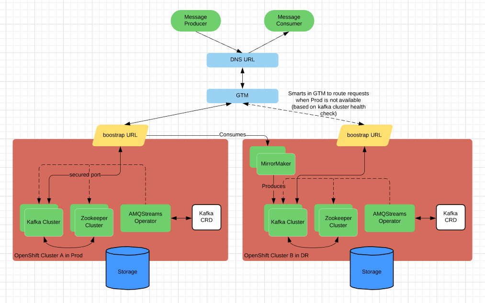

# AMQ Streams Multicluster Reference deployment

## Architecture

The architecture deployed by this template is shown in this diagram:



In this diagram two sites/data-centers are shown with a strimzi cluster operator and kafka cluster running within each site. These sites represent Production and Disaster Recovery(DR) environments. Kafka clients  produce and consume messages using an URL which is backed with Global Traffic Manager(GTM) a.k.a global load balancer. GTM will direct traffic to either Prod/DR clusters. An assumption here is, intelligence can be incorporated in GTM where it will redirect traffic to DR cluster only if Production kafka cluster healthcheck fails for configurable amount of time (say X seconds). When Production cluster becomes available, fail-back to Production needs to be planned and done during maintenance windows when clients are neither producing or consuming messages.  This is minimize the message loss due to one-way MirrorMaker mirroring limitation.

Strimzi Cluster operator can be configured to watch the creation kafka crds i.e. Kafka, KafkaTopic, KafkaUser, KafkaMirrorMaker etc. objects in certain namespaces and create kafka and zookeeper clusters.      

MirrorMaker 1.0 which does one-way replication i.e. from Production to DR will run in DR cluster. It will consume messages from Production Cluster and produce to DR cluster. This is based on eventual consistency model. With this model, there is potential for messages produced and committed in Production cluster for not being available in DR when failed over to DR cluster.
 
*Note*: Since it is a TEST environment and lack of DNS server and GTM infrastructure availability, instructions outlined below does not deploy DNS URL and GTM. Clients will directly connect to kafka's bootstrap URL.

## Installation

Get a [pull secret](https://access.redhat.com/terms-based-registry/#/accounts) for the registry.redhat.con and store it in a file called `pull-secret.base64`

In order to deploy execute the following steps

1. Set some environment variables:

    ```shell
    export PULL_SECRET=$(cat ./pull-secret.base64)
    ```